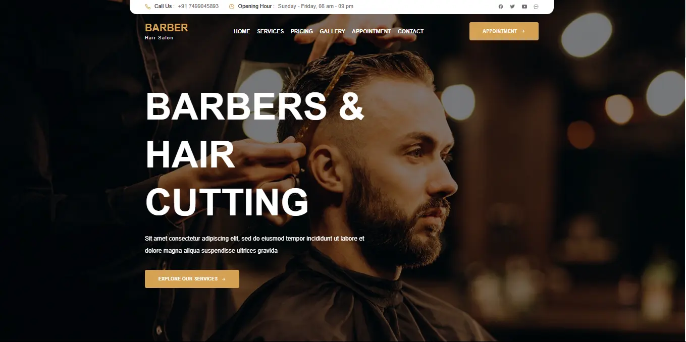

  
  
   
   

  <h2 align="center">Barber - Barber Website</h2>

  Barber is a fully responsive barber website,  Responsive for all devices, build using HTML, CSS, and JavaScript.

   <a href="https://rushikeshjadhav2004.github.io/Barber-Design/"><strong>➥ Live Demo</strong></a> 

 

### Demo Screeshots

### Prerequisites

Before you begin, ensure you have met the following requirements:

* [Git](https://git-scm.com/downloads "Download Git") must be installed on your operating system.

### Contact

If you want to contact with me you can reach me at [Linkdin](http://www.linkedin.com/in/rushikeshjadhav2004).

### License

This project is **free to use** and does not contains any license.
